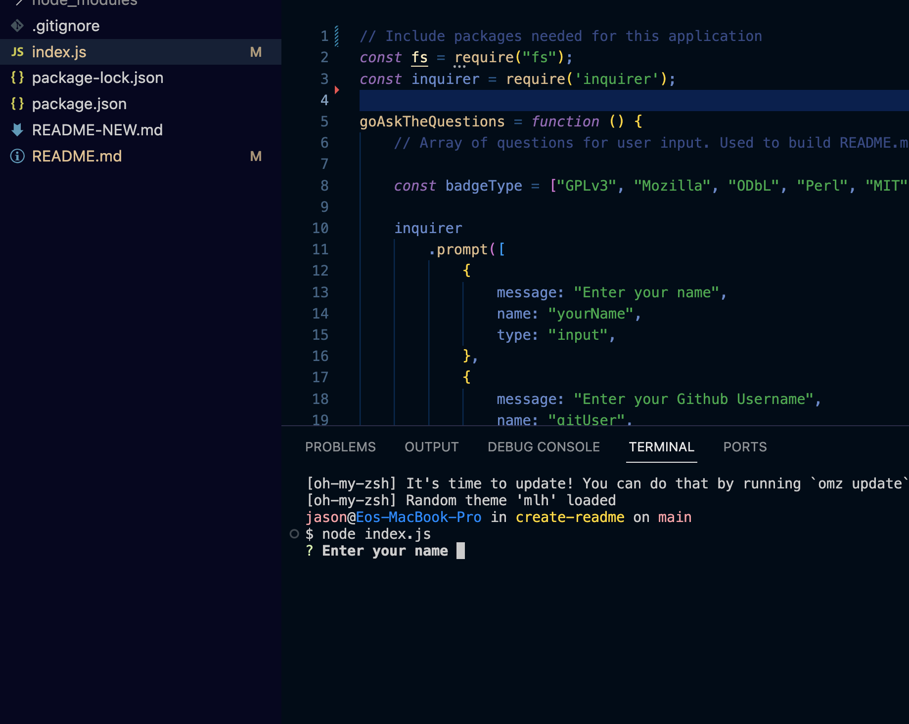
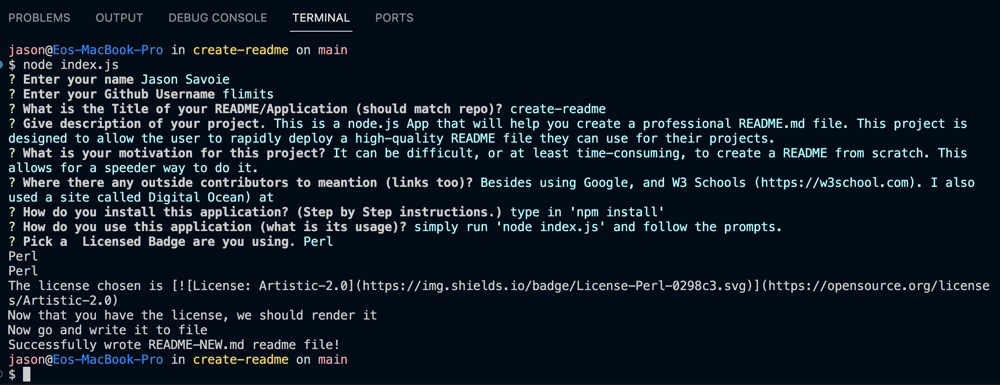
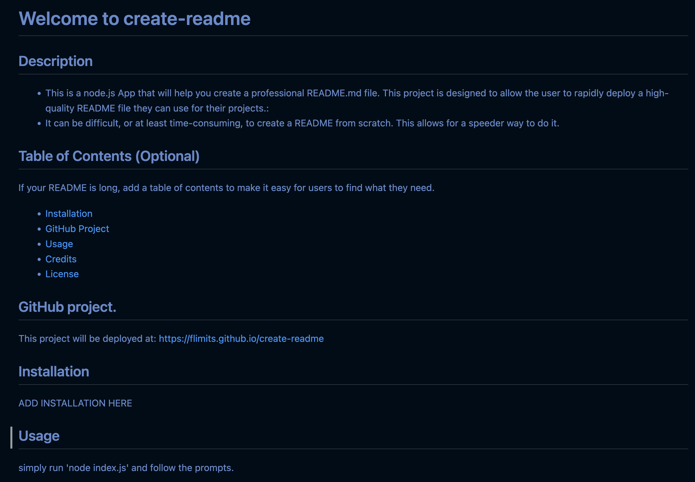

# Welcome to Create-Readme
Where you can automatically genenerate a high-quality README file quickly and relatively easy.

## Description and Motivation

This is a node.js App that will help you create a professional README.md file.

The purpose and motivation behind this appication is to give the user the ability to dynamicaly create a README file. It takes time and effort to create one from scratch, and this app "create-readme" will give them a verty good start.

Create-README is designed to be run on the command line and prompt the user for questions that will help build the README page. 
Questions such as; Repo Name, Description of app, Outside contributors, licensing/badges and contact information. The app will then assemble all of this information into a usable README that is good enough to slap onto any Git Application.

## Usage

The way you use this Application is:
- start up a commandline prompt in the directory of the cloned application.
- Run NPM install to install any dependancies: `npm install`
- Then execute the app with: `node index.js`


## Table of Contents

* [Technology Used](#technology-used)
* [Repo Location](#repo)
* [Screenshots of Application](screenshots-of-application)
* [Learning Points](#learning-points)
* [Code Snippets](#code-snippets)
* [Contact Info](#contact-info)

## Technology Used 

| Technology Used         | Resource URL           | 
| ------------- |:-------------:| 
| Git | [https://git-scm.com/](https://git-scm.com/)     |    
| Javascript | [https://developer.mozilla.org/en-US/docs/Web/JavaScript](https://developer.mozilla.org/en-US/docs/Web/JavaScript)
| Google Search | [https://www.google.com/](https://www.google.com/)
| Stack Overflow | [https://stackoverflow.com/](https://stackoverflow.com/)
| Digital Ocean for inquirer Help| [https://www.digitalocean.com/](https://www.digitalocean.com/)
| W3Schools for JS | [https://www.w3schools.com/](https://www.w3schools.com/)
| Dev for badges | [https://dev.to/cicirello/badges-tldr-for-your-repositorys-readme-3oo3](https://dev.to/cicirello/badges-tldr-for-your-repositorys-readme-3oo3)

## Repo 

[GitHub Repo](https://github.com/flimits/create-readme)


## Screenshots of Application
---
### Start Of the process. Running the app:

---
---
### Prompting for Questions and Stating it Succeeded:

---
---
### A well-rendered README Page:



## Learning Points 

The application uses multiple technologies that we learned over the last week. Besides functions, this application now incorporates Node built in modules, and external libraries we need in order to create a simple README page. There is import/export modules, downloading and installing npm packages for the first time and running one of those packages called `inquirer` that enables prompting of a user for input to various questions you might have.

There were some other things were were suppose to put in ther, but I had simply ran out of time like: constructors and prototypes, but those are currently over my head (and perhaps not required ... they will be next time!!!).

Overall, it was fun, ... but also made me pull my hair out.

## Code Snippets
---
### Using the require statement in node.js

The fist part of the application was to learn to require packages and libraries to run it. It will not run without them.
// Include packages needed for this application
const fs = require("fs");
const inquirer = require('inquirer');


---
### Inquire Appliction pulled down from NPM
It enables the function to prompt the user from the commands line to give input to the application and do something with it.

goAskTheQuestions = function () {
    // Array of questions for user input. Used to build README.md

    const badgeType = ["GPLv3", "Mozilla", "ODbL", "Perl", "MIT"];

    inquirer
        .prompt([
            {
                message: "Enter your name",
                name: "yourName",
                type: "input",
            },
            {
                message: "Enter your Github Username",
                name: "gitUser",
                type: "input",
            },
            {
                message: "What is the Title of your README/Application (should match repo)?",
                name: "title",
                type: "input",
            },
---
### This bit of code is to allow us to write the the filesystem. It is the last thing the application will do.
```
// This function is to write README file to local disk
function writeToFile(fileName, markdownData) {

    fs.writeFile(fileName, markdownData, (err) =>
        err ? console.error(err) : console.log('Successfully wrote ' + fileName + ' readme file!')
    )
};
```


## Contact Info

| Name      |Email      | Github    | Portfolio |
|-----------|-----------|-----------|-----------|
|Jason       |flimits@gmail.com|https://github.com/flimits|https://github.com/flimits/my-portfolio/|
